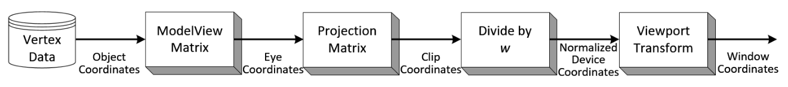

# 3D Visualization

## How to represent an 3D object
We have to follow three steps
### Modeling
Convert the 3D object into a set of multiple polygons (usually triangles), a polygon can be called as a face.
### Texturing
Fill the face using the color information and textures.
### Rig or Animation
Build a backbone structure for the 3D object for the ability to represent a motion.

## Polygon mesh
### Main components
* **Vertex**: A position (usually in 3D space) along with other information such as color, normal vector and texture coordinates.
* **Edge**: A connection between two vertices.
* **Face**: A closed set of edges, in which a triagle face has three edges, a quad face has four edges, etc.

### Rendering
Render the polygon mesh into the 2D environment such as computer screen, mobile screen, etc.

### Primitives
A primitive is formed by one or more vertices. In this case we discuss about triangle.
* Vertex: 3D point v(x, y, z)
* Triangle: A set of three points v1, v2, v3
* Normal vector: A set of three vectors n1, n2, n3 - describing the surface orientation n = (nx, ny, nz)

### Fragments
Grid-aligned fragments are interpolated from primitives after rasterizing.

## The graphics pipeline
### Vertex processing (Programmable)

#### Model Transform
Transform a point from the model space (local coordinate system of an object) to the world space (global coordinate system).
> Homogeneous coordinates: $`v=\begin{pmatrix}x\\y\\z\\1\end{pmatrix}`$  
> Ensure homogeneous when all operations are matrix multiplication (or linear transformation). Therefore, it makes the calculations faster and can inverse.
> $$f_1 \circ f_2 \circ \cdots \circ f_n(x) = M_1 \times M_2 \times \cdots \times M_N \times x = M \times x$$

Three operations (applied for homogeneous coordinates):
* Scaling:
$`S(s).v = \begin{pmatrix} s_x & 0 & 0 & 0 \\ 0 & s_y & 0 & 0 \\ 0 & 0 & s_z & 0 \\ 0 & 0 & 0 & 1 \end{pmatrix} \begin{pmatrix} x \\ y \\ z \\ 1 \end{pmatrix} = \begin{pmatrix} s_x x \\ s_y y \\ s_z z \\ 1 \end{pmatrix}`$
* Rotation:
$`R_z(\theta) = \begin{pmatrix} \cos(\theta) & -\sin(\theta) & 0 & 0 \\ \sin(\theta) & \cos(\theta) & 0 & 0 \\ 0 & 0 & 1 & 0 \\ 0 & 0 & 0 & 1 \end{pmatrix}`$
$`R_x(\theta) = \begin{pmatrix} 1 & 0 & 0 & 0 \\ 0 & \cos(\theta) & -\sin(\theta) & 0 \\ 0 & \sin(\theta) & \cos(\theta) & 0 \\ 0 & 0 & 0 & 1 \end{pmatrix}`$
$`R_y(\theta) = \begin{pmatrix} \cos(\theta) & 0 & \sin(\theta) & 0 \\ 0 & 1 & 0 & 0 \\ -\sin(\theta) & 0 & \cos(\theta) & 0 \\ 0 & 0 & 0 & 1 \end{pmatrix}`$
* Translation
$`T(d) = \begin{pmatrix} 1 & 0 & 0 & d_x \\ 0 & 1 & 0 & d_y \\ 0 & 0 & 1 & d_z \\ 0 & 0 & 0 & 1 \end{pmatrix}`$

The sequence of operations or **Model Matrix**:
$$A_1 = M \times A = T \times R \times S \times A$$
With:
* A is a set of vectors in **model space** (**model coordinates**)
* A1 is a set of vectors in **world space** (**world coordinates**)
#### View Transform
Convert from **world space** (**world coordinates**) into **eye space** (**eye coordinates**)
> Camera information
> * Camera position: $`P = \begin{pmatrix} x \\ y \\ z \end{pmatrix}`$
> * Forward vector: $`f = \begin{pmatrix} x_f \\ y_f \\ z_f \end{pmatrix}`$
> * Up vector: $`u = \begin{pmatrix} x_u \\ y_u \\ z_u \end{pmatrix}`$

We have to follow three steps:
* Normalize forward vector and up vector f and u.
* Translation P into (0, 0, 0).
* Calculate vector l using the cross product of f and u.
* Calculate vector u' using the cross product of l and f.
* u', l, f formed into a basis, next step we convert into <bold>R</bold>3 using MR (Multi-rotation operation).

> **View Matrix**
> $`V = M_R \times T(-P) = \begin{pmatrix} f_x & u_x & l_x & 0 \\ f_y & u_y & l_y & 0 \\ f_z & u_z & l_y & 0 \\ 0 & 0 & 0 & 1 \end{pmatrix}^{-1} \times \begin{pmatrix} 1 & 0 & 0 & -x \\ 0 & 1 & 0 & -y \\ 0 & 0 & 1 & -z \\ 0 & 0 & 0 & 1 \end{pmatrix}`$

#### Normal Vector Transform

#### Projection Transform
Convert from **eye space** (**eye coordinates**) into **clip space** (**clip coordinates**)
> 

#### Normalize Device Coordinate (NDC)

### Rasterizer

### Fragment processor (Programmable)

### Output merging

## Reference
* OpenGL pipeline - Lecture 2, EE267: Virtual Reality course, Stanford University. Get the detail [here](https://stanford.edu/class/ee267/lectures/lecture2.pdf)
* Songho.ca Blog. Get the detail [here](http://www.songho.ca/index.html)
