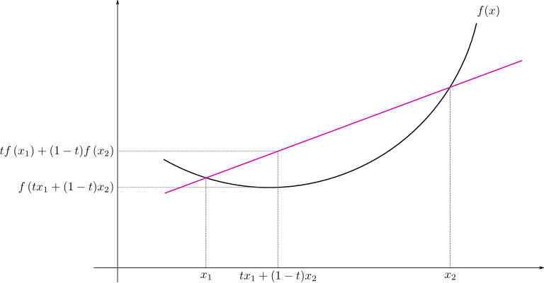

# Jensen's Inequality

For a convex funtion $`f(x)`$, we have:

$$f(\alpha x_1 + (1 - \alpha) x_2) \le \alpha f(x_1) + (1 - \alpha) f(x_2)$$

**Proof**

Besides, for a concave function $`f(x)`$, we have:

$$f(\alpha x_1 + (1 - \alpha) x_2) \ge \alpha f(x_1) + (1 - \alpha) f(x_2)$$

